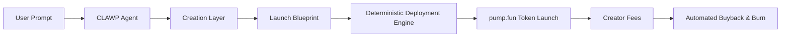

# ClawPad

**Autonomous token launch system executed by OpenClaw intelligence.**

ClawPad is a production-grade autonomous launch platform where a single idea becomes a fully deployed meme token, executed end-to-end by an OpenClaw-powered agent.

Users submit one prompt.  
The system handles creation, deployment orchestration, and post-launch mechanics under fixed, transparent rules.

---

## What ClawPad Does

ClawPad removes manual steps from token launches by introducing a deterministic autonomous execution layer.

**One prompt → one autonomous launch flow.**

### Core capabilities

- AI-driven token concept generation  
- Deterministic deployment orchestration  
- Automated buyback and burn execution using creator fees  
- No discretionary decisions  
- No manual intervention after confirmation  

---

## System Architecture

ClawPad operates as a layered autonomous system powered by OpenClaw.

---

## Creation Layer

The CLAWP Agent converts a short user idea into a complete, structured launch blueprint.

Generated outputs include:

- Token name and symbol options  
- Narrative and positioning  
- Visual direction and logo prompt  
- Launch configuration parameters  
- Buyback and burn strategy definition  

All outputs follow a fixed schema and are fully auditable.

---

## Execution Layer

Once the blueprint is confirmed, the system executes a deterministic deployment flow:

- A new, isolated wallet is generated per launch  
- The user deposits **0.025 SOL** to cover deployment costs  
- The token is deployed via **pump.fun**  
- Creator fees are programmatically routed  
- Buyback and burn executes automatically based on predefined rules  

At no point does the agent custody funds.

---

## Advisor Mode (Post-Launch)

After deployment, the same OpenClaw-powered agent continues operating in advisor mode to:

- Trigger buyback and burn actions  
- Enforce supply mechanics  
- Maintain deterministic post-launch behavior  

The agent does not speculate, trade, or make discretionary financial decisions.

---

## Design Principles

- Autonomous by default  
- Rule-based execution  
- Prompt-driven user experience  
- No custody  
- No financial advice  
- Fully auditable execution flows  

---

## Repositories

**[openclaw-clawp](https://github.com/Clawpad/openclaw-clawp)**  
CLAWP OpenClaw skill powering the ClawPad platform

**[openclaw](https://github.com/Clawpad/openclaw)**  
Forked OpenClaw runtime and integration base

---

## OpenClaw Integration

ClawPad is built directly on top of the OpenClaw agent framework.

- Uses OpenClaw skill runtime  
- Fully compatible with ClawHub  
- Declarative prompts and schemas  
- Deterministic execution guarantees  

---

## Links

- Website: https://clawp.ad  
- Documentation: https://docs.clawp.ad  
- X: https://x.com/clawpad  
- Contact: contact@clawp.ad  
